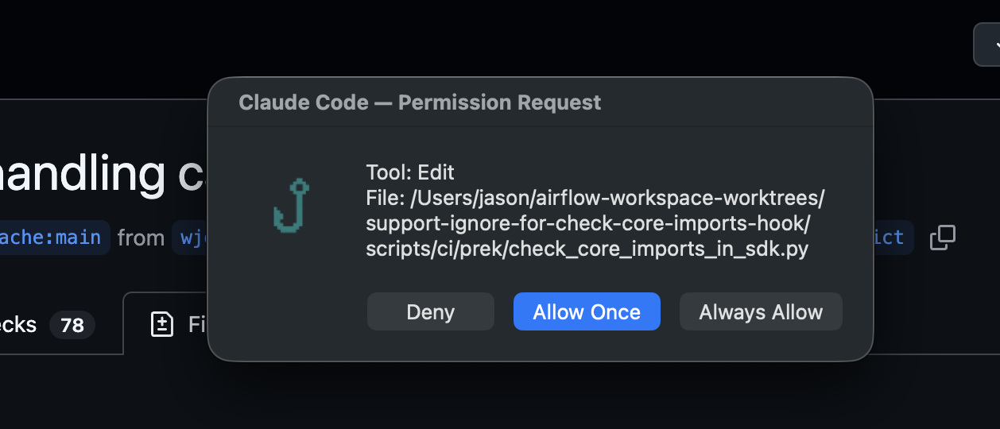
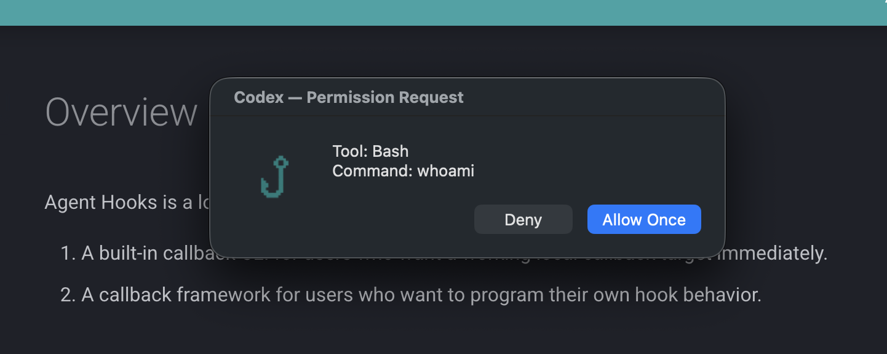

# Built-in Callback

The built-in callback command is:

```bash
agent-hooks callback
```

It resolves to the built-in app instance at `app.builtin:app`.

<p class="ah-lead">
This is the "just make it work" path: one local callback target that turns Claude Code and Codex hook payloads into native macOS dialogs and notifications.
</p>

<div class="ah-feature-grid">
  <div class="ah-feature-card">
    <h3>One dialog layer</h3>
    <p>The Allow / Always Allow / Deny choice shows up as a local macOS dialog instead of being trapped inside whichever AI session is waiting.</p>
  </div>
  <div class="ah-feature-card">
    <h3>Less desktop switching</h3>
    <p>You can respond immediately from the current desktop instead of sweeping across full-screen terminal or editor spaces to find the blocked session.</p>
  </div>
  <div class="ah-feature-card">
    <h3>Local-first setup</h3>
    <p>The built-in flow uses the system <code>osascript</code> binary. No extra Python packages. No extra macOS dependencies.</p>
  </div>
</div>

## What It Looks Like

=== "Claude Code"
    { .ah-screenshot }

    <p class="ah-caption">Claude Code permission requests become a native local dialog with <code>Deny</code>, <code>Allow Once</code>, and session-scoped <code>Always Allow</code>.</p>

=== "Codex"
    { .ah-screenshot }

    <p class="ah-caption">Codex <code>PreToolUse</code> requests become the same local dialog flow, with <code>Deny</code>, <code>Allow Once</code>, and optional <code>execpolicy</code> short-circuiting for already-allowed Bash commands.</p>

## Quick Setup

=== "Claude Code"
    Install the CLI:

    ```bash
    uv tool install agent-hooks
    ```

    Put this in `~/.claude/settings.json`:

    ```json
    {
      "hooks": {
        "PermissionRequest": [
          {
            "hooks": [
              {
                "type": "command",
                "command": "agent-hooks callback --provider claude-code"
              }
            ]
          }
        ],
        "Notification": [
          {
            "matcher": "permission_prompt",
            "hooks": [
              {
                "type": "command",
                "command": "agent-hooks callback --provider claude-code"
              }
            ]
          }
        ],
        "Stop": [
          {
            "hooks": [
              {
                "type": "command",
                "command": "agent-hooks callback --provider claude-code"
              }
            ]
          }
        ],
        "StopFailure": [
          {
            "hooks": [
              {
                "type": "command",
                "command": "agent-hooks callback --provider claude-code"
              }
            ]
          }
        ]
      }
    }
    ```

=== "Codex"
    Install the CLI:

    ```bash
    uv tool install agent-hooks
    ```

    If your Codex build still requires the feature flag, add this to `~/.codex/config.toml`:

    ```toml
    [features]
    codex_hooks = true
    ```

    Put this in `~/.codex/hooks.json`:

    ```json
    {
      "hooks": {
        "PreToolUse": [
          {
            "matcher": "Bash",
            "hooks": [
              {
                "type": "command",
                "command": "agent-hooks callback --provider codex",
                "timeout": 30
              }
            ]
          }
        ],
        "Stop": [
          {
            "hooks": [
              {
                "type": "command",
                "command": "agent-hooks callback --provider codex",
                "timeout": 30
              }
            ]
          }
        ]
      }
    }
    ```

## Provider Selection

The built-in callback can determine its provider in three ways:

1. an explicit `--provider` CLI argument
2. `AGENT_HOOK_PROVIDER`
3. provider inference from the incoming payload when the payload has unique markers

!!! tip "Best practice"
    **Use `--provider` when the caller is fixed.** Inference is helpful for mixed payload testing, but explicit provider selection removes ambiguity in production-like setups.

If you know which provider is calling the hook, using `--provider` keeps the setup explicit.

## UI Backend Selection

The built-in callback chooses where prompts appear with `--ui`:

- `--ui applescript` (default): native macOS dialogs and notifications via `osascript`.
  No extra setup; used whenever the flag is omitted.
- `--ui swift-ui`: defer prompts to the native macOS Swift app, which renders a unified
  permission queue. Add the flag to the hook command, e.g.
  `agent-hooks callback --provider claude-code --ui swift-ui`.

!!! note "swift-ui requires the Swift app"
    `--ui swift-ui` only takes effect while the Swift app (its background daemon) is
    running. When the daemon is not running, the callback automatically falls back to the
    AppleScript dialog so a hook never blocks with no UI to answer it. The swift-ui
    backend uses a shared SQLite database under
    `~/Library/Application Support/agent-hooks/queue.db` as its IPC channel; this is an
    implementation detail you do not normally configure.

## Why People Start Here

- You want one callback command that both Claude Code and Codex can call.
- You want permission prompts to surface locally on macOS instead of inside the provider UI.
- You want the fastest path to a usable hook workflow before writing a custom app.

## Built-in Event Behavior

## Claude Code

The built-in app handles:

- `Notification`
- `PermissionRequest`
- `Stop`
- `StopFailure`

Those events are rendered into local notifications or dialogs when appropriate.

## Codex

The built-in app registers:

- `SessionStart`
- `PreToolUse`
- `PostToolUse`
- `UserPromptSubmit`
- `Stop`

Current built-in behavior is intentionally narrow:

- `PreToolUse` gets permission dialogs
- `Stop` gets notifications
- `SessionStart`, `PostToolUse`, and `UserPromptSubmit` return empty responses

!!! note "Important"
    **Empty responses are expected for several Codex events.** The built-in app is meant to cover the core interactive path, not to attach custom side effects to every event out of the box.

## Codex `execpolicy` Shortcut

For Codex `PreToolUse` requests where `tool_name == "Bash"`, Agent Hooks can skip the dialog if local Codex policy has already allowed the command.

The middleware runs:

```bash
codex execpolicy check -c model="5.4-mini" --rules ~/.codex/rules/default.rules -- <command ...>
```

If the top-level JSON `decision` is `allow`, the built-in callback returns an empty response immediately.

Current environment knobs:

- `AGENT_HOOK_CODEX_EXECPOLICY_MODEL`
- `AGENT_HOOK_CODEX_EXECPOLICY_RULES`

!!! info "Why this shortcut exists"
    **Already-allowed Bash commands should not interrupt local flow again.** The `execpolicy` check lets the built-in callback avoid redundant permission dialogs for commands Codex already considers allowed.

## macOS Behavior

The built-in callback uses `osascript` for dialogs and notifications.

- On macOS, it opens real local UI
- On non-macOS platforms, AppleScript actions are skipped
- If `AGENT_HOOK_DISABLE_OSASCRIPT=1`, AppleScript actions are skipped even on macOS

!!! note "Useful during debugging"
    Disable AppleScript when you want to confirm **payload parsing, provider detection, and response formatting** without creating modal dialogs during repeated tests.

## Logging

Every callback run writes:

- an application log entry
- a raw input audit record
- a rendered response audit record

!!! note "Audit trail"
    When a permission dialog or notification does not match expectations, the input and response audit logs are the fastest way to confirm what happened.

See [Logging](../reference/logging.md) for the file layout and configuration knobs.
