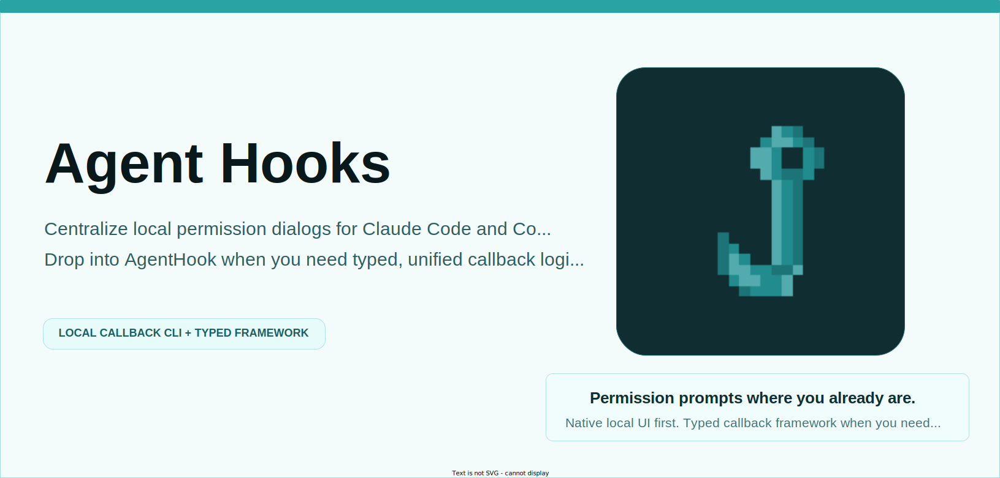

# Agent Hooks

{ .ah-hero-image }

**No more swipe-and-sweep context switching for multi-session AI coding.**

<p class="ah-lead">
Agent Hooks gives Claude Code and Codex one local callback layer: a macOS-ready CLI for native permission dialogs and notifications, plus a FastAPI-like framework when you want to own the policy in Python.
</p>


## What It Looks Like

=== "Claude Code"
    { .ah-screenshot }

    <p class="ah-caption">Claude Code permission requests become a native local dialog with <code>Deny</code>, <code>Allow Once</code>, and session-scoped <code>Always Allow</code>.</p>

=== "Codex"
    { .ah-screenshot }

    <p class="ah-caption">Codex <code>PreToolUse</code> requests become the same local dialog flow, with <code>Deny</code>, <code>Allow Once</code>, and optional <code>execpolicy</code> short-circuiting for already-allowed Bash commands.</p>

=== "`AgentHook` framework"
    ```python
    from agent_hooks import AgentHook, PermissionRequestEvent, build_permission_response
    from agent_hooks.enums import DialogButton

    app = AgentHook()


    @app.permission()
    def permission_handler(hook_event: PermissionRequestEvent):
        if hook_event.tool_name == "Bash":
            return build_permission_response(DialogButton.ALLOW_ONCE, hook_event)
        return build_permission_response(DialogButton.DENY, hook_event)
    ```

    ```bash
    agent-hooks run my_hooks:app --provider codex
    ```

    <p class="ah-caption">One typed handler can serve Claude Code <code>PermissionRequest</code> and Codex <code>PreToolUse</code> without writing provider-specific schema glue.</p>

<div class="ah-feature-grid">
  <div class="ah-feature-card">
    <h3>Centralized local permission UI</h3>
    <p>Bring provider permission prompts back to the current macOS desktop instead of hunting through separate AI session windows and desktop spaces.</p>
  </div>
  <div class="ah-feature-card">
    <h3>Business logic over wire glue</h3>
    <p>Write handlers against typed, normalized events while Agent Hooks handles schema differences and response rendering for each provider.</p>
  </div>
  <div class="ah-feature-card">
    <h3>Zero extra local baggage</h3>
    <p>No runtime Python dependency chain in the library itself and no extra macOS package install beyond what already ships with the OS.</p>
  </div>
</div>

- Keep hook UX local on macOS with the system `osascript` binary out-of-the-box
- Build custom apps with FastAPI-like decorator routes such as `@app.permission()` with unified schema
- **Zero** runtime Python package dependencies in the library itself (no dependency chain attack to worry about!)
- Keep raw inputs, rendered outputs, and app logs under one local logging model
- Support both `claude-code` and `codex`

## Why It Exists

Multi-session AI coding tends to break flow in the same places:

- permission prompts appear in separate sessions
- provider payloads differ
- local hook responses need provider-specific wire shapes
- stop and notification events want OS-local behavior, not more terminal noise

Agent Hooks normalizes those problems into one package.

## Two Products In One Package


!!! note "What matters most"
    - **Use `agent-hooks callback`** when you want a working local callback target immediately.
    - **Use `AgentHook`** when you need to define custom permission, notification, or stop behavior in Python.

### Built-in CLI

The built-in app is exposed as `agent_hooks.cli_app.app:app` and run through:

```bash
agent-hooks callback
```

This path is designed for local-first usage on macOS:

- permission dialogs
- notifications
- provider-aware response rendering
- rotating logs and audit logs

### Framework

The framework is centered on `AgentHook`, a decorator-based router that looks and feels closer to FastAPI than to handwritten hook glue.

You register handlers with route decorators such as:

- `@app.notification()`
- `@app.permission()`
- `@app.session_start()`
- `@app.user_prompt_submit()`
- `@app.post_tool_use()`
- `@app.stop()`
- `@app.stop_failure()`

## Provider-Neutral Core

Internally, incoming payloads are normalized into shared models before dispatch. That gives you one app-level programming model even when providers use different raw event names.

Examples:

- Claude `PermissionRequest` and Codex `PreToolUse` both route through `@app.permission()`
- both providers share the same `HookPayload` base model
- provider-specific response wire formats are handled by adapters

## Start Here

If you want the fastest path, install the tool and wire the built-in callback into your provider config.

=== "Claude Code"
    Install the CLI:

    ```bash
    uv tool install agent-hooks
    ```

    Put this in `~/.claude/settings.json`:

    ```json
    {
      "hooks": {
        "PermissionRequest": [
          {
            "hooks": [
              {
                "type": "command",
                "command": "agent-hooks callback --provider claude-code"
              }
            ]
          }
        ],
        "Notification": [
          {
            "matcher": "permission_prompt",
            "hooks": [
              {
                "type": "command",
                "command": "agent-hooks callback --provider claude-code"
              }
            ]
          }
        ],
        "Stop": [
          {
            "hooks": [
              {
                "type": "command",
                "command": "agent-hooks callback --provider claude-code"
              }
            ]
          }
        ],
        "StopFailure": [
          {
            "hooks": [
              {
                "type": "command",
                "command": "agent-hooks callback --provider claude-code"
              }
            ]
          }
        ]
      }
    }
    ```

    This is enough to route Claude Code permission, notification, and stop events into the built-in callback.

=== "Codex"
    Install the CLI:

    ```bash
    uv tool install agent-hooks
    ```

    If your Codex build still requires the feature flag, add this to `~/.codex/config.toml`:

    ```toml
    [features]
    codex_hooks = true
    ```

    Put this in `~/.codex/hooks.json` (The `timeout` config is optional but recommended to prevent hanging sessions if the callback fails or is misconfigured):

    ```json
    {
      "hooks": {
        "PreToolUse": [
          {
            "matcher": "Bash",
            "hooks": [
              {
                "type": "command",
                "command": "agent-hooks callback --provider codex",
                "timeout": 30
              }
            ]
          }
        ],
        "Stop": [
          {
            "hooks": [
              {
                "type": "command",
                "command": "agent-hooks callback --provider codex",
                "timeout": 30
              }
            ]
          }
        ]
      }
    }
    ```

    This is enough to route Codex Bash permission checks and stop notifications into the built-in callback.

!!! tip "Recommended setup"
    **Pass `--provider` explicitly** in your provider config when you can. The built-in callback can infer providers from payload markers, but the explicit flag keeps local setup easier to reason about and debug.

If you want to build your own hook app, start with [AgentHook](framework/agenthook.md) and then run it with [`agent-hooks run`](cli/custom-apps.md).

## Docs Map

- [Features](features.md): what the project does today
- [macOS Quickstart](getting-started/macos-quickstart.md): install, wire up, and smoke-test the built-in callback
- [Built-in Callback](cli/builtin-callback.md): the out-of-box CLI behavior
- [AgentHook](framework/agenthook.md): the callback framework
- [Architecture Overview](architecture/overview.md): end-to-end callback flow
- [Claude Code](providers/claude-code.md) and [Codex](providers/codex.md): provider-specific implementation details and limitations

## Scope

Agent Hooks currently supports only two providers:

- Claude Code
- Codex

!!! note "Current scope"
    The docs stay aligned with the current implementation. They describe **supported behavior that exists today**, not placeholder integrations for future providers.

The docs intentionally stay aligned with the current implementation rather than promising future providers.
